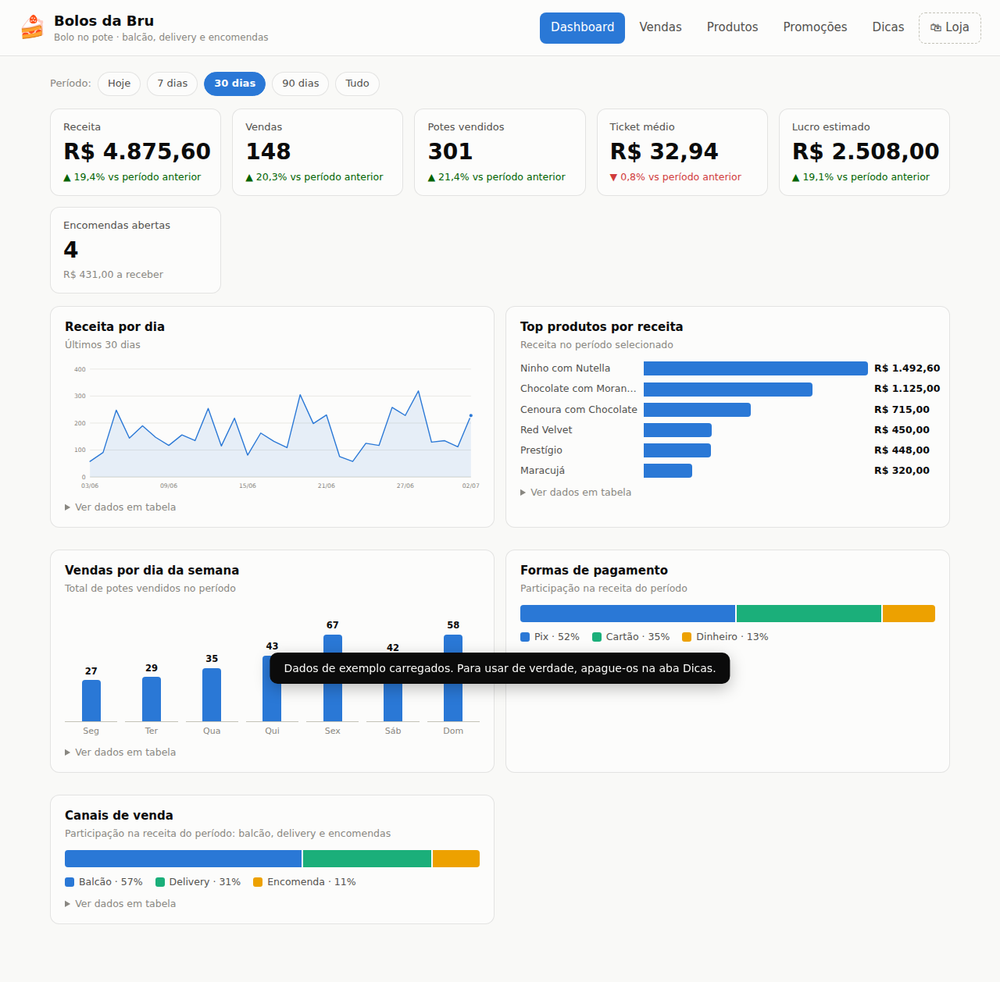
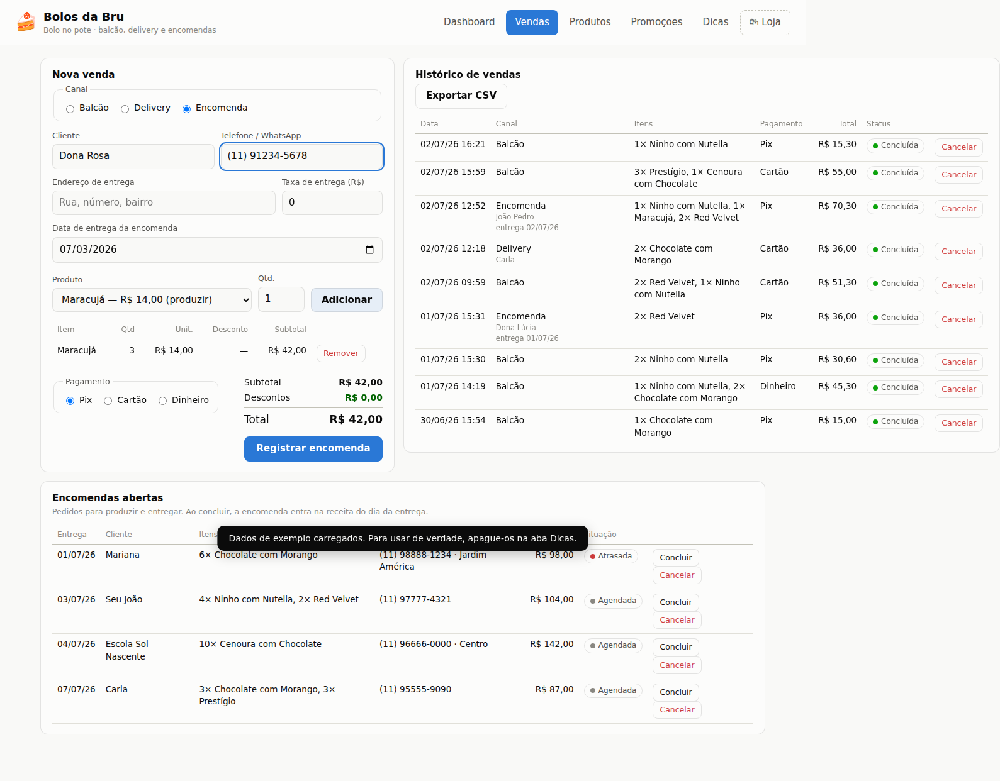
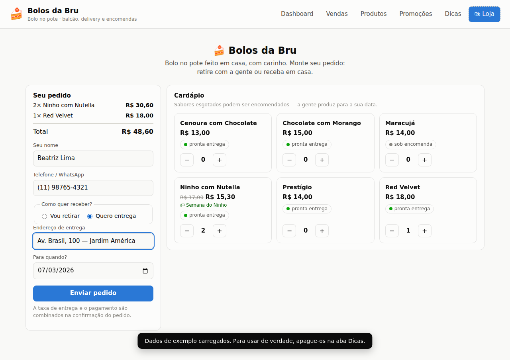
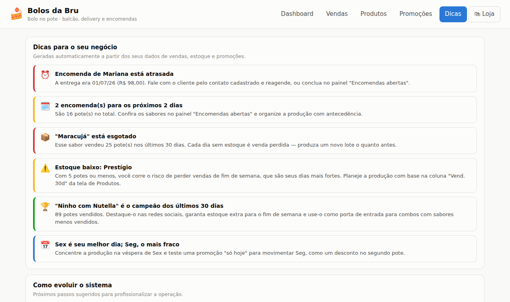

# 🍰 Bolos da Bru — Gestão de vendas de bolo no pote

[](https://github.com/GhansenGoncalves/portifolioGHG/actions/workflows/tests.yml)

Sistema web completo para o dia a dia de uma loja de bolo no pote: dashboard
com indicadores, vendas de **balcão**, **delivery** (com taxa de entrega) e
**encomendas** (produção para data marcada), catálogo com controle de estoque,
promoções aplicadas automaticamente, uma **Loja on-line** onde o cliente monta
o próprio pedido e dicas geradas a partir dos dados reais do negócio.

## Como usar

Não precisa instalar nada: abra o `index.html` em qualquer navegador moderno.
Os dados ficam salvos no próprio navegador (localStorage).

O sistema começa **vazio**, pronto para os seus produtos reais. Se quiser
explorar antes, o botão "Carregar dados de exemplo" da tela inicial preenche
tudo com dados fictícios — e dá para apagar depois na aba Dicas.

Se preferir servir por HTTP:

```bash
npm start   # sobe em http://127.0.0.1:4173
```

## Telas

| Dashboard | Vendas e encomendas |
|---|---|
|  |  |

| Loja (visão do cliente) | Dicas geradas dos dados |
|---|---|
|  |  |

O tema escuro segue a preferência do sistema: [ver screenshot](docs/screenshots/dashboard-dark.png).

## Funcionalidades

### 📊 Dashboard
- KPIs do período (receita, vendas, potes, ticket médio, lucro estimado) com
  comparação contra o período anterior, mais o total de encomendas abertas.
- Filtro de período (hoje / 7 / 30 / 90 dias / tudo) que re-escopa tudo.
- Cinco gráficos interativos com tooltip e visão em tabela: receita por dia,
  top produtos, dia da semana, formas de pagamento e canais de venda.
- Modo claro/escuro automático.

### 🛒 Vendas (balcão, delivery e encomenda)
- Carrinho com múltiplos itens e promoções aplicadas automaticamente.
- **Balcão**: venda direta, baixa o estoque na hora.
- **Delivery**: cliente, endereço e taxa de entrega somada ao total (a taxa
  não entra no lucro — assume-se que cobre o deslocamento).
- **Encomenda**: cliente, contato e data de entrega. Não exige estoque pronto
  (produção sob demanda — dá até para encomendar sabor esgotado) e só vira
  receita quando concluída, no dia da entrega.
- Painel **Encomendas abertas** com status (atrasada / hoje / agendada),
  conclusão e cancelamento.
- Histórico completo com canal e cliente, cancelamento com estorno de estoque
  e exportação CSV (backup).

### 🛍 Loja (visão do cliente)
- Cardápio com preços (e preços promocionais), pronta entrega ou sob encomenda.
- O cliente monta o pedido, escolhe retirada ou entrega e a data — o pedido
  entra direto em "Encomendas abertas".
- Botão "Enviar resumo no WhatsApp": com o número da loja salvo nas
  Configurações (aba Dicas), o resumo do pedido vai direto para o seu WhatsApp.

### 🧁 Produtos e 🏷️ Promoções
- Cadastro com preço, custo, margem calculada e alertas de estoque.
- Promoções em % ou R$, por produto ou gerais, com vigência e status.

### 💡 Dicas
- Análises geradas dos seus dados: encomendas atrasadas, produção dos próximos
  dias, estoque esgotado/baixo, margens apertadas, sabores parados, melhores
  dias, ticket médio, Pix e delivery.
- Roteiro de evolução do sistema.

## Usando para vendas reais

O sistema funciona 100% no navegador, sem servidor. Isso significa:

- **Os dados vivem no aparelho onde você usa o sistema.** Use sempre no mesmo
  navegador (ex.: o Chrome do seu computador ou celular) e exporte o CSV de
  vendas com frequência como backup.
- **Pedidos on-line chegam pelo WhatsApp.** Quando um cliente abre a Loja no
  celular dele, o pedido é registrado no aparelho *dele* — por isso o botão de
  WhatsApp existe: o resumo chega no seu número e você registra a encomenda
  (configure o número em Dicas → Configurações da loja).
- Para pedidos caírem sozinhos no seu painel de qualquer lugar, o próximo passo
  é um banco de dados on-line (ver roteiro na aba Dicas).

### Hospedagem (GitHub Pages)

1. Faça o merge deste projeto na branch `main`.
2. No GitHub: **Settings → Pages → Source: Deploy from a branch → `main`**.
3. O sistema fica no ar em
   `https://<seu-usuario>.github.io/portifolioGHG/bolos-da-bru/` — grátis e
   com HTTPS. Divulgue esse link para os clientes usarem a aba 🛍 Loja.

## Testes automatizados

Suíte E2E com [Playwright](https://playwright.dev): 26 testes cobrindo primeiro
acesso, dashboard e filtros, os três canais de venda, encomendas (inclusive
atraso e estorno), a loja do cliente, CRUD de produtos e promoções, dicas,
configurações, persistência, CSV e modo escuro.

```bash
npm install
npx playwright install chromium   # primeira vez
npm test
```

Cada teste roda em contexto isolado do navegador, sem dependência de ordem.

## Tecnologia

HTML, CSS e JavaScript puros — sem dependências de runtime, sem build.
Gráficos em SVG feitos à mão, paleta validada para daltonismo e contraste,
dados persistidos em localStorage.
